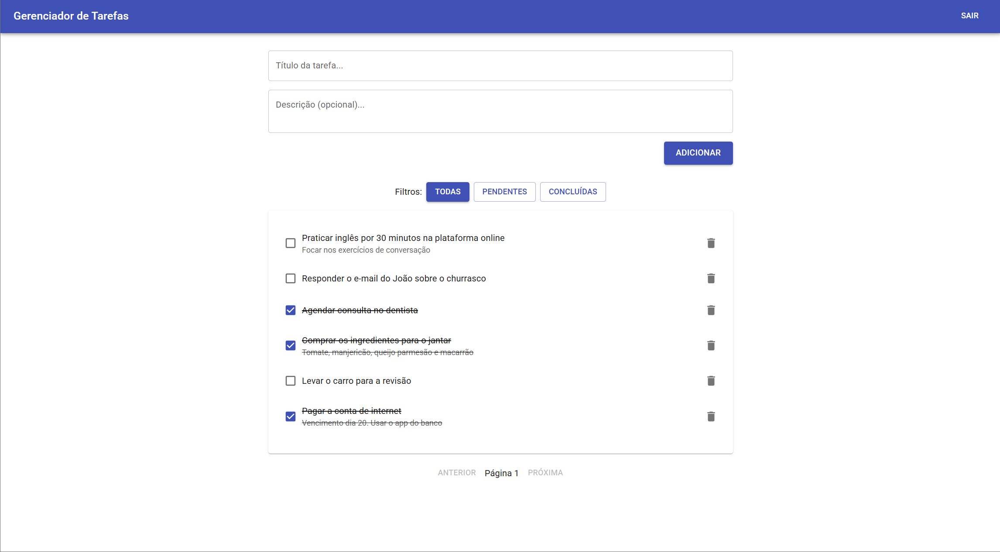
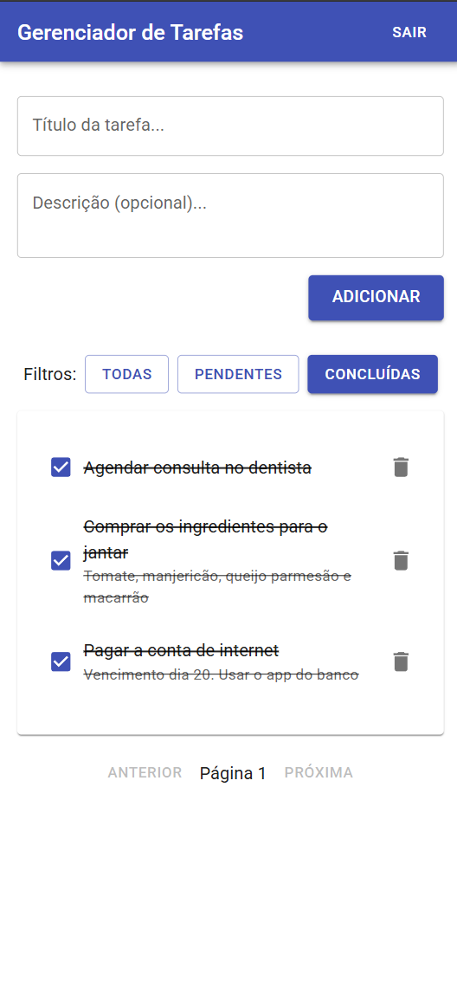

# Gerenciador de Tarefas - Desafio Técnico

    

Uma aplicação web full-stack de gerenciamento de tarefas (To-Do List) com autenticação de usuário, CRUD de tarefas, filtros e uma interface moderna e responsiva.

## Descrição do Projeto

Este projeto foi desenvolvido como parte de um processo seletivo. O objetivo foi criar uma API REST com Django REST Framework e um frontend com React, seguindo as melhores práticas de desenvolvimento.

<table align="center">
  <tr>
    <td align="center">
      
    </td>
    <td align="center">
      
    </td>
  </tr>
</table>

## Funcionalidades

* [x] **Autenticação Segura:** Sistema completo de registro e login via API com tokens.
* [x] **Gerenciamento de Tarefas:** Usuários podem Criar, Ler, Atualizar e Deletar suas próprias tarefas.
* [x] **Interface Intuitiva:** Frontend desenvolvido em React com a biblioteca de componentes MUI, inspirada no Material Design 3.
* [x] **Filtros e Paginação:** A lista de tarefas pode ser filtrada por status e os resultados são paginados para melhor performance.
* [x] **Containerização:** Aplicação totalmente containerizada com Docker e Docker Compose para um setup de desenvolvimento rápido e consistente.

## Rodando o Projeto com Docker

### **Instruções**

1.  **Clone o repositório:**

    ```bash
    git clone https://github.com/hignicao/to-do-list
    cd to-do-list
    ```

2.  **Construa e inicie os contêineres:**

    ```bash
    docker-compose up --build
    ```

3.  **Pronto!**
    - O **Frontend** estará acessível em `http://localhost:3000`.
    - O **Backend (API)** estará acessível em `http://localhost:8000`.

Para parar a aplicação, pressione `Ctrl + C` no terminal e depois execute `docker-compose down`.

<br>

<details>
<summary>👉 Ou... Rodando o Projeto Manualmente</summary>

### **1. Backend**

```bash
# Navegue até a pasta do backend
cd backend

# Crie e ative o ambiente virtual
# No Windows:
python -m venv venv
venv\Scripts\activate
# No Linux/macOS:
# python3 -m venv venv
# source venv/bin/activate

# Instale as dependências
pip install -r requirements.txt

# Aplique as migrações no banco de dados
python manage.py migrate

# Inicie o servidor do backend
python manage.py runserver
# O backend estará rodando em http://127.0.0.1:8000
```

### **2. Frontend**

```bash
# Em outro terminal, navegue até a pasta do frontend
cd frontend

# Instale as dependências
npm install

# Inicie a aplicação React
npm start
# O frontend estará rodando em http://localhost:3000
```

</details>

## Endpoints da API

| Método HTTP | Endpoint              | Descrição                                      | Autenticação Requerida |
| :---------- | :-------------------- | :--------------------------------------------- | :--------------------- |
| `POST`      | `/api/auth/register/` | Registra um novo usuário.                      | Não                    |
| `POST`      | `/api/login/`         | Realiza o login e retorna um token.            | Não                    |
| `GET`       | `/api/tasks/`         | Lista as tarefas do usuário logado.            | Sim (Token)            |
| `POST`      | `/api/tasks/`         | Cria uma nova tarefa.                          | Sim (Token)            |
| `GET`       | `/api/tasks/{id}/`    | Retorna os detalhes de uma tarefa.             | Sim (Token)            |
| `PATCH`     | `/api/tasks/{id}/`    | Atualiza parcialmente uma tarefa (ex: status). | Sim (Token)            |
| `DELETE`    | `/api/tasks/{id}/`    | Deleta uma tarefa.                             | Sim (Token)            |

## Arquitetura e Decisões de Design

- **Backend com Django REST Framework:** Escolhido pela sua robustez, segurança e ferramentas completas para a criação rápida de APIs RESTful.
- **Frontend com React:** Utilizado para criar uma Single Page Application (SPA) dinâmica e com ótima experiência de usuário.
- **Autenticação por Token:** A autenticação `TokenAuthentication` do DRF foi escolhida por ser stateless e ideal para o desacoplamento entre API e cliente. A implementação foi customizada para ter mais controle, ao invés de usar bibliotecas de terceiros como `dj-rest-auth`.
- **Separação de Responsabilidades:** O projeto foi dividido em apps Django (`tasks`, `users`) e uma estrutura de pastas clara no React (`pages`, `components`, `services`) para manter o código organizado e modular.
- **Component Library (MUI):** A biblioteca MUI foi adotada para acelerar o desenvolvimento do UI, garantindo um design moderno, consistente e alinhado com as diretrizes do Material Design.
- **Containerização com Docker:** A aplicação foi totalmente dockerizada para garantir um ambiente de desenvolvimento consistente e simplificar o processo de setup, além de ser o primeiro passo para um pipeline de CI/CD.
